# WatchWave Authentication Module Documentation

## Table of Contents
1. [Overview](#overview)
2. [Architecture](#architecture)
3. [Database Design](#database-design)
4. [Authentication Flow](#authentication-flow)
5. [Authorization System](#authorization-system)
6. [API Reference](#api-reference)
7. [Security Features](#security-features)
8. [Code Structure](#code-structure)
9. [Testing Guide](#testing-guide)
10. [Deployment & Configuration](#deployment--configuration)
11. [Troubleshooting](#troubleshooting)

---

## Overview

The **WatchWave Authentication Module** is a production-ready, enterprise-grade authentication and authorization system built with Spring Boot. It provides comprehensive user management, role-based access control, and JWT-based stateless authentication for a YouTube-like video platform.

### 🎯 What This Module Provides

- **🔐 Secure Authentication** - JWT-based stateless authentication
- **👥 User Management** - Complete user lifecycle management
- **🛡️ Role-Based Access Control** - Three-tier permission system (USER → CREATOR → ADMIN)
- **📧 Email Verification** - Account verification workflow
- **👤 Profile Management** - User profile and password management
- **⚙️ Admin Panel** - Administrative controls and user management

### 🛠️ Technology Stack

| Component | Technology | Version |
|-----------|------------|---------|
| Framework | Spring Boot | 3.2.0 |
| Security | Spring Security | 6.x |
| Authentication | JWT | - |
| Database | PostgreSQL | 15+ |
| ORM | JPA/Hibernate | 6.x |
| Password Encryption | BCrypt | - |
| Build Tool | Maven | 3.8+ |
| Java Version | Java | 21 |

---

## Architecture

### 🏗️ High-Level Architecture


### 📁 Module Structure

```
watchwave-auth/
├── 📁 src/main/java/org/Learn/watchwave/auth/
│   ├── 📁 config/              # Security & application configuration
│   ├── 📁 controller/          # REST API endpoints
│   ├── 📁 dto/                 # Data Transfer Objects
│   │   ├── 📁 request/         # Request DTOs
│   │   └── 📁 response/        # Response DTOs
│   ├── 📁 model/               # Database entities
│   │   ├── 📁 entity/          # JPA entities
│   │   └── 📁 id/              # Composite key classes
│   ├── 📁 repository/          # Data access layer
│   ├── 📁 security/            # Security components
│   ├── 📁 service/             # Business logic
│   │   ├── 📁 impl/            # Service implementations
│   │   └── 📁 jwt/             # JWT utilities
│   └── 📁 enums/               # Enumeration classes
└── 📁 src/main/resources/
    └── 📄 application.properties  # Configuration
```

---

## Database Design

### 🗄️ Entity Relationship Diagram


### 📊 Database Tables

#### Users Table (`auth.users`)
```sql
CREATE TABLE auth.users (
    id UUID PRIMARY KEY DEFAULT gen_random_uuid(),
    username VARCHAR(50) UNIQUE NOT NULL,
    email VARCHAR(100) UNIQUE NOT NULL,
    password_hash VARCHAR(255) NOT NULL,
    profile_pic_url VARCHAR(500),
    is_blocked BOOLEAN DEFAULT FALSE,
    is_verified BOOLEAN DEFAULT FALSE,
    verification_token VARCHAR(255),
    created_at TIMESTAMP DEFAULT CURRENT_TIMESTAMP,
    updated_at TIMESTAMP DEFAULT CURRENT_TIMESTAMP
);

-- Indexes for performance
CREATE INDEX idx_users_email ON auth.users(email);
CREATE INDEX idx_users_username ON auth.users(username);
CREATE INDEX idx_users_verification_token ON auth.users(verification_token);
```

#### Roles Table (`auth.roles`)
```sql
CREATE TABLE auth.roles (
    id SERIAL PRIMARY KEY,
    role_name VARCHAR(50) UNIQUE NOT NULL,
    description TEXT
);

-- Insert default roles
INSERT INTO auth.roles (role_name, description) VALUES 
('USER', 'Default user role with basic permissions'),
('CREATOR', 'Content creator role with video upload permissions'),
('ADMIN', 'Administrator role with full system access');
```

#### User Roles Table (`auth.user_roles`)
```sql
CREATE TABLE auth.user_roles (
    user_id UUID REFERENCES auth.users(id) ON DELETE CASCADE,
    role_id INT REFERENCES auth.roles(id) ON DELETE CASCADE,
    PRIMARY KEY (user_id, role_id)
);

-- Indexes for performance
CREATE INDEX idx_user_roles_user_id ON auth.user_roles(user_id);
CREATE INDEX idx_user_roles_role_id ON auth.user_roles(role_id);
```

---

## Authentication Flow

### 🔑 User Registration Flow


### 🔐 User Login Flow


### 🛡️ Protected Endpoint Access Flow


---

## Authorization System

### 🏆 Role Hierarchy

```mermaid
graph TD
    A[👑 ADMINFull system access] --> B[🎬 CREATORVideo upload + USER permissions]
    B --> C[👤 USERBasic access]
    
    style A fill:#ff6b6b
    style B fill:#4ecdc4
    style C fill:#45b7d1
```



### 📈 Role Progression

| Transition | Approval Required | Method |
|------------|------------------|---------|
| USER → CREATOR | ❌ No | Direct upgrade via `/api/creator/upgrade` |
| CREATOR → ADMIN | ✅ Yes | Request via `/api/roles/request-admin` |

### 🔒 Permission Matrix

| Feature | 👤 USER | 🎬 CREATOR | 👑 ADMIN |
|---------|---------|-----------|----------|
| View content | ✅ | ✅ | ✅ |
| Manage own profile | ✅ | ✅ | ✅ |
| Upload videos | ❌ | ✅ | ✅ |
| Manage own videos | ❌ | ✅ | ✅ |
| View all users | ❌ | ❌ | ✅ |
| Manage user roles | ❌ | ❌ | ✅ |
| Block/unblock users | ❌ | ❌ | ✅ |
| System administration | ❌ | ❌ | ✅ |

---

## API Reference

### 🔐 Authentication Endpoints

#### Register User
```http
POST /api/auth/register
Content-Type: application/json

{
    "username": "johndoe",
    "email": "john@example.com",
    "password": "password123",
    "gender": "Male",
    "birthdate": "1990-01-01",
    "location": "New York",
    "bio": "Hello, I'm John!"
}
```

**Response (201 Created):**
```json
{
    "token": "eyJhbGciOiJIUzI1NiJ9...",
    "username": "johndoe",
    "email": "john@example.com"
}
```

#### Login User
```http
POST /api/auth/login
Content-Type: application/json

{
    "email": "john@example.com",
    "password": "password123"
}
```

**Response (200 OK):**
```json
{
    "token": "eyJhbGciOiJIUzI1NiJ9...",
    "username": "johndoe",
    "email": "john@example.com"
}
```

### 👤 User Management Endpoints

#### Get Current User
```http
GET /api/users/me
Authorization: Bearer 
```

**Response (200 OK):**
```json
{
    "id": "uuid-here",
    "username": "johndoe",
    "email": "john@example.com",
    "profilePicUrl": null,
    "verified": false,
    "blocked": false,
    "roles": ["USER"],
    "gender": "Male",
    "birthdate": "1990-01-01",
    "location": "New York",
    "bio": "Hello, I'm John!"
}
```

#### Update User Information
```http
PATCH /api/users/me
Authorization: Bearer 
Content-Type: application/json

{
    "username": "johnsmith",
    "profilePicUrl": "https://example.com/profile.jpg"
}
```

### 🎬 Role Management Endpoints

#### Upgrade to Creator (No Approval)
```http
POST /api/creator/upgrade
Authorization: Bearer 
```

**Response (200 OK):**
```json
{
    "message": "Successfully upgraded to Creator role"
}
```

#### Request Admin Role (Requires Approval)
```http
POST /api/roles/request-admin
Authorization: Bearer 
```

**Response (200 OK):**
```json
{
    "message": "Admin role request submitted for approval"
}
```

### 👑 Admin Endpoints

#### View Pending Role Requests
```http
GET /api/roles/requests
Authorization: Bearer 
```

**Response (200 OK):**
```json
[
    {
        "id": "request-uuid",
        "userId": "user-uuid",
        "requestedRole": "ADMIN",
        "status": "PENDING",
        "requestedAt": "2025-05-30T18:30:00.965Z",
        "reviewedAt": null,
        "username": "johndoe",
        "userEmail": "john@example.com"
    }
]
```

#### Approve/Reject Role Request
```http
PATCH /api/roles/requests/{requestId}
Authorization: Bearer 
Content-Type: application/json

{
    "status": "APPROVED"  // or "REJECTED"
}
```

---

## Security Features

### 🔒 Security Implementation

#### 1. Password Security
- **BCrypt Encryption**: All passwords hashed with salt (strength: 12)
- **Password Validation**: Minimum 6 characters, complexity rules
- **Secure Password Change**: Requires current password verification

#### 2. JWT Token Security
- **Algorithm**: HMAC SHA-256
- **Expiration**: Configurable (default: 24 hours)
- **Stateless**: No server-side session storage
- **Validation**: Signature and expiration checks on every request

#### 3. Authorization Security
- **Method-Level**: `@PreAuthorize` annotations
- **Role-Based**: Granular permissions
- **Resource Protection**: Different access levels

#### 4. Data Protection
- **Input Validation**: Bean Validation annotations
- **SQL Injection Prevention**: JPA parameterized queries
- **XSS Prevention**: JSON serialization with escaping
- **CORS**: Configurable cross-origin policies

### 🛡️ Security Configuration

```java
@Configuration
@EnableWebSecurity
@EnableMethodSecurity(prePostEnabled = true)
public class SecurityConfig {
    
    @Bean
    public SecurityFilterChain securityFilterChain(HttpSecurity http) {
        return http
            .csrf(csrf -> csrf.disable())
            .authorizeHttpRequests(auth -> auth
                .requestMatchers("/api/auth/**").permitAll()
                .requestMatchers("/api/email/**").permitAll()
                .requestMatchers("/api/admin/**").hasRole("ADMIN")
                .requestMatchers("/api/creator/**").hasRole("USER")
                .requestMatchers("/api/roles/request-admin").hasRole("CREATOR")
                .anyRequest().authenticated()
            )
            .sessionManagement(session -> 
                session.sessionCreationPolicy(SessionCreationPolicy.STATELESS)
            )
            .addFilterBefore(jwtAuthenticationFilter, 
                UsernamePasswordAuthenticationFilter.class)
            .build();
    }
}
```

---

## Code Structure

### 🏗️ Architecture Patterns

#### Repository Pattern
```java
@Repository
public interface UserRepository extends JpaRepository {
    Optional findByEmail(String email);
    boolean existsByEmail(String email);
    
    @Query("SELECT u FROM User u LEFT JOIN FETCH u.roles ur LEFT JOIN FETCH ur.role WHERE u.id = :userId")
    Optional findByIdWithRoles(@Param("userId") UUID userId);
}
```

#### Service Layer Pattern
```java
@Service
@Transactional
public class AuthServiceImpl implements AuthService {
    
    private final UserRepository userRepository;
    private final PasswordEncoder passwordEncoder;
    private final JwtService jwtService;
    
    @Override
    public AuthResponse register(RegisterRequest request) {
        // Validation
        if (userRepository.existsByEmail(request.getEmail())) {
            throw new RuntimeException("Email already exists");
        }
        
        // Create user
        User user = createUser(request);
        User savedUser = userRepository.save(user);
        
        // Assign default role
        assignDefaultRole(savedUser);
        
        // Generate token
        String token = jwtService.generateToken(savedUser);
        return new AuthResponse(token, savedUser.getUsername(), savedUser.getEmail());
    }
}
```

#### DTO Pattern
```java
@Data
public class RegisterRequest {
    @NotBlank(message = "Username is required")
    @Size(min = 2, max = 50)
    private String username;
    
    @Email(message = "Email should be valid")
    @NotBlank(message = "Email is required")
    private String email;
    
    @NotBlank(message = "Password is required")
    @Size(min = 6, message = "Password must be at least 6 characters")
    private String password;
    
    // Optional profile fields
    private String gender;
    private LocalDate birthdate;
    private String location;
    private String bio;
}
```

### 🔧 Key Components

#### JWT Service
```java
@Service
public class JwtService {
    
    @Value("${jwt.secret}")
    private String jwtSecret;
    
    @Value("${jwt.expiration}")
    private long jwtExpiration;
    
    public String generateToken(User user) {
        return Jwts.builder()
                .setSubject(user.getId().toString())
                .claim("username", user.getUsername())
                .setIssuedAt(new Date())
                .setExpiration(new Date(System.currentTimeMillis() + jwtExpiration))
                .signWith(SignatureAlgorithm.HS256, jwtSecret.getBytes())
                .compact();
    }
    
    public boolean isTokenValid(String token) {
        try {
            Jwts.parserBuilder()
                    .setSigningKey(jwtSecret.getBytes())
                    .build()
                    .parseClaimsJws(token);
            return true;
        } catch (Exception e) {
            return false;
        }
    }
}
```

---

## Testing Guide

### 🧪 Test Environment Setup

#### Prerequisites
- ✅ PostgreSQL Database running on localhost:5432
- ✅ Postman or similar API testing tool
- ✅ Application running on localhost:8080

#### Test Data
```json
{
    "testUser": {
        "username": "testuser",
        "email": "test@example.com",
        "password": "password123",
        "bio": "Test user account"
    },
    "adminUser": {
        "email": "admin@watchwave.com",
        "password": "admin123"
    }
}
```

### 📋 Test Scenarios

#### Complete User Journey
```bash
# 1. Register new user
POST /api/auth/register
# Save JWT token from response

# 2. Verify email (optional)
POST /api/email/verify?token={verification_token}

# 3. Login with credentials
POST /api/auth/login
# Verify same user data returned

# 4. Get user profile
GET /api/users/me
# Verify user data and roles

# 5. Update profile
PATCH /api/users/me
# Verify changes applied

# 6. Upgrade to creator
POST /api/creator/upgrade
# Verify CREATOR role added

# 7. Request admin role
POST /api/roles/request-admin
# Verify request created
```

#### Admin Workflow
```bash
# 1. Login as admin
POST /api/auth/login
# Use admin credentials

# 2. View pending requests
GET /api/roles/requests
# See pending admin requests

# 3. Approve request
PATCH /api/roles/requests/{id}
Body: {"status": "APPROVED"}

# 4. Verify user has admin role
# Login as user and check /api/users/me
```

### 🔍 Testing Checklist

- [ ] User registration with valid data
- [ ] User registration with duplicate email/username
- [ ] User login with valid credentials
- [ ] User login with invalid credentials
- [ ] JWT token validation
- [ ] Protected endpoint access with valid token
- [ ] Protected endpoint access with invalid token
- [ ] Role-based authorization
- [ ] Email verification flow
- [ ] Password change functionality
- [ ] Profile update functionality
- [ ] Creator role upgrade
- [ ] Admin role request and approval

---

## Deployment & Configuration

### ⚙️ Application Properties

```properties
# Database Configuration
spring.datasource.url=jdbc:postgresql://localhost:5432/WatchWave
spring.datasource.username=${DB_USERNAME:akshat}
spring.datasource.password=${DB_PASSWORD:root}
spring.datasource.driver-class-name=org.postgresql.Driver

# JPA Configuration
spring.jpa.hibernate.ddl-auto=${DDL_AUTO:validate}
spring.jpa.show-sql=${SHOW_SQL:false}
spring.jpa.properties.hibernate.dialect=org.hibernate.dialect.PostgreSQLDialect
spring.jpa.properties.hibernate.default_schema=auth
spring.jpa.open-in-view=false

# JWT Configuration
jwt.secret=${JWT_SECRET:QWERTYUIOPASDFGHJKLZXCVBNMqwertyuiop123456}
jwt.expiration=${JWT_EXPIRATION:86400000}

# Server Configuration
server.port=${SERVER_PORT:8080}

# Email Configuration (for production)
spring.mail.host=${MAIL_HOST:smtp.gmail.com}
spring.mail.port=${MAIL_PORT:587}
spring.mail.username=${MAIL_USERNAME:}
spring.mail.password=${MAIL_PASSWORD:}
spring.mail.properties.mail.smtp.auth=true
spring.mail.properties.mail.smtp.starttls.enable=true

# Logging Configuration
logging.level.org.springframework.security=${LOG_LEVEL_SECURITY:INFO}
logging.level.org.hibernate.SQL=${LOG_LEVEL_SQL:INFO}
```

### 🐳 Docker Configuration

```dockerfile
FROM openjdk:21-jdk-slim

WORKDIR /app

COPY target/watchwave-auth-1.0.0.jar app.jar

EXPOSE 8080

ENV SPRING_PROFILES_ACTIVE=production

ENTRYPOINT ["java", "-jar", "app.jar"]
```

### 🔧 Environment Variables

| Variable | Description | Default |
|----------|-------------|---------|
| `DB_USERNAME` | Database username | `akshat` |
| `DB_PASSWORD` | Database password | `root` |
| `JWT_SECRET` | JWT signing secret | (default value) |
| `JWT_EXPIRATION` | Token expiration (ms) | `86400000` |
| `SERVER_PORT` | Application port | `8080` |

---

## Troubleshooting

### 🚨 Common Issues & Solutions

#### 1. LazyInitializationException
**Problem**: Accessing lazy-loaded entities outside transaction
```
org.hibernate.LazyInitializationException: could not initialize proxy - no Session
```

**Solution**:
- Use `@Transactional(readOnly = true)` on service methods
- Use JOIN FETCH queries in repositories
- Ensure proper session management

#### 2. 403 Forbidden on Protected Endpoints
**Problem**: User lacks required role or authentication failed

**Solution**:
- Verify JWT token is valid and not expired
- Check user roles in database
- Ensure proper Authorization header format: `Bearer `

#### 3. Circular Reference in JSON
**Problem**: Infinite loops during JSON serialization
```
com.fasterxml.jackson.databind.JsonMappingException: Infinite recursion
```

**Solution**:
- Use `@JsonIgnore` on back-references
- Use `@JsonManagedReference/@JsonBackReference`
- Implement DTOs for API responses

#### 4. Database Connection Issues
**Problem**: Cannot connect to PostgreSQL database

**Solution**:
- Verify PostgreSQL is running
- Check connection parameters in application.properties
- Ensure database and schema exist
- Verify user permissions

### 🔧 Debug Commands

```bash
# Check application logs
docker logs watchwave-auth

# Verify database connection
psql -U akshat -d WatchWave -c "SELECT 1;"

# Test JWT token
curl -H "Authorization: Bearer " http://localhost:8080/api/users/me

# Check user roles
SELECT u.username, r.role_name 
FROM auth.users u 
JOIN auth.user_roles ur ON u.id = ur.user_id 
JOIN auth.roles r ON ur.role_id = r.id;
```

---
