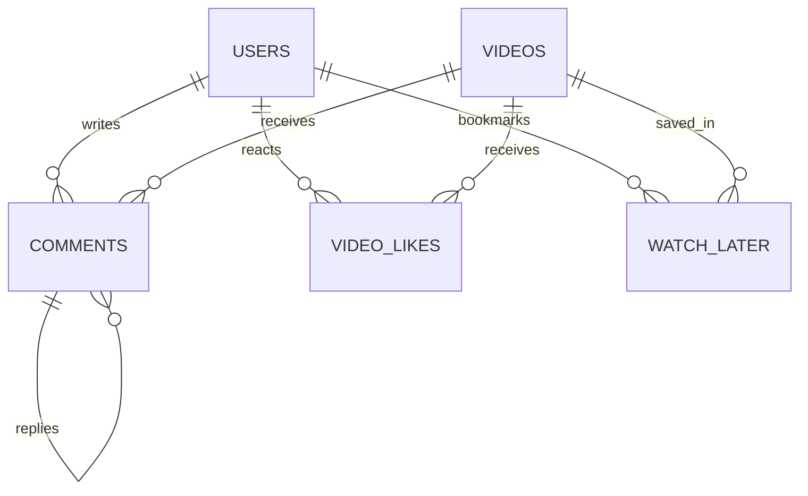

# WatchWave Interactions Module Documentation

## Table of Contents
1. [Overview](#overview)
2. [Database Design](#database-design)
3. [Feature Set](#feature-set)
4. [Authorization & Security](#authorization--security)
5. [API Reference](#api-reference)
6. [Code Structure](#code-structure)
7. [Testing Guide](#testing-guide)
8. [Troubleshooting & Best Practices](#troubleshooting--best-practices)

---

## Overview

The **WatchWave Interactions Module** enables rich social engagement on the WatchWave platform. It handles all user interactions with videos, including likes/dislikes, comments (with threaded replies), watch later lists, and user history. The module is designed for scalability, security, and seamless integration with the Auth, Video, and Subscribe modules.

### 🎯 What This Module Provides

- **👍 Likes/Dislikes:** Track user reactions to videos.
- **💬 Comments & Replies:** Threaded commenting system with moderation.
- **🕒 Watch Later:** Personalized video bookmarking.
- **📜 History:** User video watch history (integration-ready).
- **🔒 Role-Based Access:** Secure endpoints with JWT and role checks.

### 🛠️ Technology Stack

| Component     | Technology         | Version |
|---------------|--------------------|---------|
| Framework     | Spring Boot        | 3.2.x   |
| Security      | Spring Security    | 6.x     |
| Auth          | JWT Integration    | -       |
| Database      | MySQL/PostgreSQL   | 8+/15+  |
| ORM           | JPA/Hibernate      | 6.x     |
| Build Tool    | Maven              | 3.8+    |
| Java Version  | Java               | 21      |

---

## Database Design

### 🗄️ Entity Relationship Diagram



### 📊 Table Summaries

#### Comments (`interactions.comments`)
- **Fields:** id, user_id, video_id, parent_id, content, is_deleted, deleted_at, created_at
- **Features:** Threaded replies, soft delete, timestamps

#### Video Likes (`interactions.video_likes`)
- **Fields:** id, user_id, video_id, is_like, created_at
- **Features:** Unique per user/video, like/dislike boolean

#### Watch Later (`interactions.watch_later`)
- **Fields:** id, user_id, video_id, added_at
- **Features:** Unique per user/video, ordered by added_at

#### History (`analytics.history`) *(integration-ready)*
- **Fields:** id, user_id, video_id, watched_at, watch_duration_seconds, last_position_seconds, watch_percent

---

## Feature Set

### 👍 Likes & Dislikes
- Users can like or dislike any video (one reaction per video).
- Counts are visible to all; reactions require authentication.
- Toggle or remove reaction at any time.

### 💬 Comments & Replies
- Add comments to any video (threaded via parent_id).
- Replies are nested one level deep.
- Users can delete their own comments; video owners and admins can moderate.
- Soft delete preserves thread integrity.

### 🕒 Watch Later
- Users can bookmark videos to watch later.
- List is private and ordered by most recent.
- Duplicate adds are idempotent.

### 📜 History *(integration-ready)*
- Tracks when and how much of a video a user watched.
- Used for recommendations and analytics.

---

## Authorization & Security

### 🏆 Role-Based Access Control

| Feature         | USER | CREATOR | ADMIN |
|-----------------|------|---------|-------|
| Like/Dislike    | ✅   | ✅      | ✅    |
| Comment/Reply   | ✅   | ✅      | ✅    |
| Delete Own      | ✅   | ✅      | ✅    |
| Delete on Video | ❌   | ✅      | ✅    |
| Delete Any      | ❌   | ❌      | ✅    |
| Watch Later     | ✅   | ✅      | ✅    |

- **JWT Required:** All mutations (POST/DELETE) require authentication.
- **Ownership Checks:** Only comment author, video owner, or admin can delete comments.
- **Soft Delete:** Comments are marked as deleted, not removed from DB.

### 🔒 Security Features

- **Method-Level Security:** @PreAuthorize and service-layer checks.
- **Input Validation:** Bean validation on all DTOs.
- **SQL Injection Protection:** JPA parameterized queries.
- **Data Integrity:** Unique constraints and foreign keys.

---

## API Reference

### 👍 Likes/Dislikes

| Endpoint                                    | Method | Auth | Description                   |
|----------------------------------------------|--------|------|-------------------------------|
| `/api/videos/{videoId}/likes`                | POST   | Yes  | Like/dislike a video          |
| `/api/videos/{videoId}/likes`                | DELETE | Yes  | Remove like/dislike           |
| `/api/videos/{videoId}/likes/count`          | GET    | No   | Get like/dislike counts       |
| `/api/videos/{videoId}/likes/me`             | GET    | Yes  | Get current user's reaction   |

#### Example Request: Like a Video
```http
POST /api/videos/abcd-1234/likes
Authorization: Bearer 
Content-Type: application/json

{ "liked": true }
```

---

### 💬 Comments & Replies

| Endpoint                                                | Method | Auth | Description                       |
|---------------------------------------------------------|--------|------|-----------------------------------|
| `/api/videos/{videoId}/comments`                        | POST   | Yes  | Add comment or reply              |
| `/api/videos/{videoId}/comments`                        | GET    | No   | List all comments for a video     |
| `/api/videos/{videoId}/comments/{commentId}/replies`    | GET    | No   | List replies to a comment         |
| `/api/videos/{videoId}/comments/{commentId}`            | DELETE | Yes  | Delete a comment (role-based)     |

#### Example Request: Add a Comment
```http
POST /api/videos/abcd-1234/comments
Authorization: Bearer 
Content-Type: application/json

{ "content": "Great video!", "parentId": null }
```

---

### 🕒 Watch Later

| Endpoint                                         | Method | Auth | Description                       |
|--------------------------------------------------|--------|------|-----------------------------------|
| `/api/users/me/watch-later`                      | POST   | Yes  | Add video to watch later          |
| `/api/users/me/watch-later/{videoId}`            | DELETE | Yes  | Remove video from watch later     |
| `/api/users/me/watch-later`                      | GET    | Yes  | List watch later videos           |
| `/api/users/me/watch-later/contains/{videoId}`   | GET    | Yes  | Check if video is in watch later  |

#### Example Request: Add to Watch Later
```http
POST /api/users/me/watch-later
Authorization: Bearer 
Content-Type: application/json

{ "videoId": "abcd-1234" }
```

---

## Code Structure

### 🏗️ Layers

- **Controller Layer:** Handles HTTP requests, extracts user info, delegates to services.
- **Service Layer:** Business logic, validation, role checks, transaction management.
- **Repository Layer:** Data access via JPA.
- **DTOs:** Request/response objects for API boundaries.
- **Entities:** JPA-mapped domain objects.

### 📁 Package Layout

```
org.learn.watchwave.interactions
├── controller
├── dto
│   ├── request
│   └── response
├── model.entity
├── repository
├── service
│   └── impl
└── config
```

---

## Testing Guide

### 🧪 Manual Testing

- Use Postman/curl to test all endpoints.
- Test with/without JWT, as different users/roles.
- Test edge cases: duplicate likes, deleting other's comment, adding same video to watch later twice.

### 🧪 Automated Testing

- Use JUnit + MockMvc for integration tests.
- Mock authentication for role-based tests.
- Test all CRUD operations and error cases.

### 🔍 Testing Checklist

- [ ] Like/dislike a video (toggle, remove)
- [ ] Comment/reply (add, list, delete own, delete as video owner/admin)
- [ ] Watch later (add, remove, list, check)
- [ ] Unauthorized access blocked
- [ ] Input validation errors handled

---

## Troubleshooting & Best Practices

- **403 Forbidden:** Check JWT and user roles; verify security config.
- **Cannot resolve property:** Ensure DTO/entity fields match repository method names.
- **Soft delete not working:** Ensure `isDeleted`/`deleted` field is set and queries filter on it.
- **Performance:** Use indexes on `user_id`, `video_id` for large tables.

### 🛡️ Security Best Practices

- Principle of Least Privilege: Only allow necessary actions per role.
- Input validation everywhere (DTOs, service layer).
- Always use prepared statements (JPA does this by default).
- Deny all by default in security config; explicitly permit only needed endpoints.

---


**The Interactions Module is the social backbone of WatchWave—modular, secure, and ready for scale.**

[1] https://ppl-ai-file-upload.s3.amazonaws.com/web/direct-files/attachments/71543222/1a4e007c-3089-46b6-b19f-2274e4a9c388/paste.txt