# WatchWave Video Module Documentation - Phase 1

## Table of Contents
1. [Overview](#overview)
3. [Database Design](#database-design)
4. [Video Upload Flow](#video-upload-flow)
5. [Authorization System](#authorization-system)
6. [API Reference](#api-reference)
7. [Security Features](#security-features)
8. [Code Structure](#code-structure)
9. [Testing Guide](#testing-guide)
10. [Deployment & Configuration](#deployment--configuration)
11. [Troubleshooting](#troubleshooting)

---

## Overview

The **WatchWave Video Module** is a production-ready, enterprise-grade video management system built with Spring Boot. It provides comprehensive video upload, management, and streaming capabilities with role-based access control for a YouTube-like video platform.

### 🎯 What Phase 1 Provides

- **🎬 Video Upload System** - Secure file upload with validation
- **📁 File Management** - Video and thumbnail storage with URL generation
- **🏷️ Tag System** - Many-to-many tag relationships for video categorization
- **📋 CRUD Operations** - Complete video lifecycle management
- **🛡️ Role-Based Access Control** - CREATOR and ADMIN permissions
- **🔒 Security** - Ownership validation and JWT authentication
- **📄 Pagination** - Scalable video listing with pagination
- **👑 Admin Moderation** - Video restoration and permanent deletion

### 🛠️ Technology Stack

| Component | Technology | Version |
|-----------|------------|---------|
| Framework | Spring Boot | 3.2.0 |
| Security | Spring Security | 6.x |
| Authentication | JWT Integration | - |
| Database | PostgreSQL | 15+ |
| ORM | JPA/Hibernate | 6.x |
| File Storage | Local File System | - |
| Build Tool | Maven | 3.8+ |
| Java Version | Java | 21 |

---


```

---

## Database Design

### 🗄️ Entity Relationship Diagram


### 📊 Database Tables

#### Videos Table (`videos.videos`)
- **Primary Key**: UUID id
- **Required Fields**: title, video_url, video_file_path, uploader_id
- **File Information**: video_file_size, thumbnail_file_size, thumbnail_content_type
- **Metadata**: description, visibility, processing_status, views
- **Timestamps**: created_at, updated_at
- **Soft Delete**: is_deleted flag

#### Tags Table (`videos.tags`)
- **Primary Key**: UUID id
- **Unique Constraint**: name (case-insensitive)
- **Automatic Creation**: Tags created on first use
- **Reusability**: Same tag can be used by multiple videos

#### Video Tags Table (`videos.video_tags`)
- **Composite Primary Key**: video_id + tag_id
- **Many-to-Many Relationship**: Links videos and tags
- **Cascade Delete**: Removes relationships when video/tag deleted

---

## Video Upload Flow

### 🎬 Video Upload Process


### 📁 File Storage Strategy

```mermaid
graph LR
    A[Uploaded File] --> B[File Validation]
    B --> C[Generate Unique Name]
    C --> D[Save to Disk]
    D --> E[Generate Public URL]
    E --> F[Store Paths in DB]
    
    subgraph "File Naming"
        G[videoId_timestamp.mp4]
        H[videoId_thumb_timestamp.jpg]
    end
    
    subgraph "URL Generation"
        I[/api/videos/{id}/stream]
        J[/api/thumbnails/{id}]
    end
```

### 🔧 File Management Features

- **Unique File Names**: UUID + timestamp prevents conflicts
- **File Validation**: Content type and size validation
- **Dual Storage**: Both file paths and public URLs stored
- **Thumbnail Support**: Optional thumbnail upload
- **Size Limits**: 500MB for videos, 10MB for thumbnails
- **Format Support**: Multiple video and image formats

---

## Authorization System

### 🏆 Role-Based Access Control

```mermaid
graph TD
    A[👑 ADMINFull video management] --> B[🎬 CREATORUpload & manage own videos]
    B --> C[👤 USERView public videos only]
    
    style A fill:#ff6b6b
    style B fill:#4ecdc4
    style C fill:#45b7d1
```



### 🔒 Permission Matrix

| Feature | 👤 USER | 🎬 CREATOR | 👑 ADMIN |
|---------|---------|-----------|----------|
| View public videos | ✅ | ✅ | ✅ |
| View user profiles | ✅ | ✅ | ✅ |
| Upload videos | ❌ | ✅ | ✅ |
| Update own videos | ❌ | ✅ | ✅ |
| Delete own videos | ❌ | ✅ | ✅ |
| Update any video | ❌ | ❌ | ✅ |
| Delete any video | ❌ | ❌ | ✅ |
| View all videos (including deleted) | ❌ | ❌ | ✅ |
| Restore deleted videos | ❌ | ❌ | ✅ |
| Permanently delete videos | ❌ | ❌ | ✅ |

### 🛡️ Security Implementation

- **Method-Level Security**: @PreAuthorize annotations on endpoints
- **Ownership Validation**: Users can only modify their own videos
- **Admin Override**: Admins can perform any video operation
- **JWT Integration**: Secure token-based authentication
- **Role Extraction**: Automatic role detection from JWT claims

---

## API Reference

### 🎬 Video Management Endpoints

#### Upload Video
**Endpoint**: `POST /api/videos/upload`
**Authorization**: Bearer token (CREATOR role required)
**Content-Type**: multipart/form-data

**Form Fields**:
- `videoFile`: Video file (required, max 500MB)
- `thumbnailFile`: Image file (optional, max 10MB)
- `title`: Video title (required, max 255 chars)
- `description`: Video description (optional, max 5000 chars)
- `visibility`: PUBLIC/PRIVATE/UNLISTED (default: PUBLIC)
- `isCommentEnabled`: Boolean (default: true)
- `tags`: Array of strings (optional, max 50 chars each)

**Response**: VideoResponse object with video details and URLs

#### Get Single Video
**Endpoint**: `GET /api/videos/{videoId}`
**Authorization**: None (public access)
**Response**: VideoResponse object

#### Update Video
**Endpoint**: `PUT /api/videos/{videoId}`
**Authorization**: Bearer token (CREATOR/ADMIN role)
**Content-Type**: multipart/form-data
**Note**: Only video owner or admin can update

#### Delete Video
**Endpoint**: `DELETE /api/videos/{videoId}`
**Authorization**: Bearer token (CREATOR/ADMIN role)
**Behavior**: Soft delete (sets is_deleted flag)

### 📋 Video Listing Endpoints

#### Get All Public Videos
**Endpoint**: `GET /api/videos`
**Parameters**:
- `page`: Page number (default: 0)
- `size`: Page size (default: 20)
  **Response**: VideoListResponse with pagination info

#### Get User's Videos
**Endpoint**: `GET /api/videos/user/{userId}`
**Parameters**: page, size
**Response**: All public videos by specific user

#### Get Current User's Videos
**Endpoint**: `GET /api/videos/my`
**Authorization**: Bearer token required
**Response**: All videos (including private) by authenticated user

### 👑 Admin Endpoints

#### Get All Videos for Admin
**Endpoint**: `GET /api/videos/admin/all`
**Authorization**: Bearer token (ADMIN role required)
**Response**: All videos including deleted ones

#### Restore Deleted Video
**Endpoint**: `PUT /api/videos/admin/{videoId}/restore`
**Authorization**: Bearer token (ADMIN role required)
**Behavior**: Unsets is_deleted flag

#### Permanently Delete Video
**Endpoint**: `DELETE /api/videos/admin/{videoId}/permanent`
**Authorization**: Bearer token (ADMIN role required)
**Behavior**: Removes video record and files from system

---

## Security Features

### 🔒 Authentication & Authorization

#### JWT Token Integration
- **Token Extraction**: Automatic extraction from Authorization header
- **User Context**: Retrieves user ID, username, and roles from token
- **Role Validation**: Verifies user has required permissions
- **Token Validation**: Ensures token is valid and not expired

#### File Security
- **Content Type Validation**: Ensures uploaded files are videos/images
- **Size Limits**: Prevents oversized file uploads
- **Unique Naming**: Prevents file conflicts and overwrites
- **Path Security**: Public URLs hide actual file locations

#### Data Protection
- **Input Validation**: Bean Validation on all request DTOs
- **SQL Injection Prevention**: JPA parameterized queries
- **Ownership Checks**: Users can only access their own resources
- **Soft Delete**: Preserves data integrity with recovery options

### 🛡️ Security Best Practices

- **Principle of Least Privilege**: Users get minimum required permissions
- **Defense in Depth**: Multiple security layers
- **Secure by Default**: Safe default configurations
- **Audit Trail**: Comprehensive logging of all operations

---

## Code Structure

### 🏗️ Architecture Patterns

#### Layered Architecture
- **Controller Layer**: HTTP request handling and response formatting
- **Service Layer**: Business logic and transaction management
- **Repository Layer**: Data access and persistence
- **Utility Layer**: Cross-cutting concerns and helpers

#### Design Patterns Used
- **Repository Pattern**: Data access abstraction
- **Service Layer Pattern**: Business logic encapsulation
- **DTO Pattern**: Data transfer and validation
- **Builder Pattern**: Object construction
- **Strategy Pattern**: File handling strategies

#### Key Components

##### Video Entity
- **JPA Entity**: Maps to videos table
- **Relationships**: Many-to-one with User, one-to-many with VideoTag
- **Validation**: Bean Validation annotations
- **Auditing**: Automatic timestamp management

##### Tag System
- **Many-to-Many Relationship**: Videos can have multiple tags
- **Composite Key**: VideoTag uses composite primary key
- **Case-Insensitive**: Tag names stored in lowercase
- **Automatic Creation**: Tags created on first use

##### Service Layer
- **Transaction Management**: @Transactional annotations
- **Error Handling**: Comprehensive exception handling
- **Logging**: Detailed operation logging
- **Validation**: Business rule validation

---

## Testing Guide

### 🧪 Test Environment Setup

#### Prerequisites
- ✅ PostgreSQL Database running on localhost:5432
- ✅ Auth module working with JWT tokens
- ✅ Postman or similar API testing tool
- ✅ Sample video and image files for testing
- ✅ Application running on localhost:8080

#### Test Data Requirements
- **Creator User**: User with CREATOR role and valid JWT token
- **Admin User**: User with ADMIN role for admin endpoint testing
- **Test Files**: Sample video files (MP4, AVI) and image files (JPG, PNG)
- **Invalid Files**: Non-video files for validation testing

### 📋 Test Scenarios

#### Complete Video Upload Journey
1. **Register and login as creator**
2. **Upload video with metadata**
3. **Verify video appears in listings**
4. **Update video metadata**
5. **Verify updates applied**
6. **Delete video (soft delete)**
7. **Verify video not in public listings**

#### Admin Moderation Workflow
1. **Login as admin**
2. **View all videos including deleted**
3. **Restore deleted video**
4. **Permanently delete video**
5. **Verify video completely removed**

#### Security Testing
1. **Try uploading without CREATOR role** (should fail)
2. **Try updating someone else's video** (should fail)
3. **Try admin operations without ADMIN role** (should fail)
4. **Try accessing with invalid/expired token** (should fail)

#### File Upload Testing
1. **Upload valid video file** (MP4, AVI, MOV)
2. **Try uploading non-video file** (should fail)
3. **Try uploading oversized file** (>500MB should fail)
4. **Upload with and without thumbnail**

#### Data Validation Testing
1. **Upload without title** (should fail)
2. **Upload without video file** (should fail)
3. **Upload with minimal data** (title + video file only)
4. **Test tag creation and reuse**

### 🔍 Testing Checklist

- [ ] Video upload with all fields
- [ ] Video upload with minimal fields
- [ ] File validation (type, size)
- [ ] Authentication and authorization
- [ ] Video listing and pagination
- [ ] Video update functionality
- [ ] Soft delete and restore
- [ ] Permanent delete
- [ ] Tag creation and association
- [ ] Error handling and responses

---
Here's a **comprehensive list of all new features and improvements** you've implemented in the WatchWave Video Module, ready to be added to your documentation:

---

## **New Features & Improvements**

### **1. Video Streaming with Seeking/Buffering**
- **HTTP Range Support**:
  - Endpoint: `GET /api/videos/{videoId}/stream`
  - Handles `Range: bytes=start-end` headers for partial content
  - Returns `206 Partial Content` status for valid range requests
  - Sets `Content-Range` header for browser compatibility
- **Byte-Range Handling**:
  - Parses and validates range headers
  - Streams only requested chunks (no full-file loading)
  - Supports large files (>2GB) via `RandomAccessFile`

## **Updated API Reference**

### **Streaming Endpoints**
| Endpoint | Method | Headers | Response |
|----------|--------|---------|----------|
| `/api/videos/{id}/stream` | GET | `Range: bytes=start-end` (optional) | `200 OK` (full file) or `206 Partial Content` |
| `/api/thumbnails/{id}` | GET | None | `200 OK` with cached thumbnail |

### **New Response Headers**
| Header | Example Value | Purpose |
|--------|---------------|---------|
| `Content-Range` | `bytes 0-999/5000` | Shows served byte range |
| `Accept-Ranges` | `bytes` | Indicates range support |
| `Content-Length` | `1000` | Size of current chunk |

---

## **Configuration Changes**

### **application.properties**
```properties
# Streaming Optimization
spring.servlet.multipart.max-file-size=500MB
server.max-http-header-size=8192

# CORS (Development)
cors.allowed-origins=http://localhost:8000
cors.exposed-headers=Content-Range,Content-Length
```

### **SecurityConfig.java**
```java
http
  .securityMatcher("/api/videos/**", "/api/thumbnails/**")
  .authorizeHttpRequests(authz -> authz
      .requestMatchers(HttpMethod.OPTIONS).permitAll()
      .requestMatchers(HttpMethod.GET, "/api/videos/*/stream").permitAll()
  );
```

---

## **Testing Procedures**

### **Range Request Testing**
```bash
# Test full download
curl -v http://localhost:8080/api/videos/{videoId}/stream

# Test range request
curl -v -H "Range: bytes=1000-1999" http://localhost:8080/api/videos/{videoId}/stream
```

### **Browser Testing Checklist**
1. Serve HTML via `python -m http.server 8000`
2. Use `` tag with `controls` attribute
3. Verify seeking works without CORS errors
4. Check network tab for `206` responses

---


## 🚀 Next Steps

### Phase 2 Planning
After mastering Phase 1, consider these enhancements:

#### Immediate Improvements
- [ ] **Video Streaming Endpoints** - Implement actual video streaming
- [ ] **Thumbnail Generation** - Automatic thumbnail extraction from videos
- [ ] **Video Processing** - Basic video format conversion
- [ ] **Search Functionality** - Video search by title, tags, description

#### Advanced Features
- [ ] **Video Transcoding** - Multiple quality options (720p, 1080p, 4K)
- [ ] **CDN Integration** - Content delivery network for global access
- [ ] **Analytics** - View tracking and engagement metrics
- [ ] **Recommendations** - AI-powered video recommendations

#### Performance Optimizations
- [ ] **Caching Layer** - Redis for frequently accessed data
- [ ] **Database Optimization** - Query optimization and indexing
- [ ] **Async Processing** - Background video processing
- [ ] **Load Balancing** - Multiple instance support

#### Integration Features
- [ ] **Comment System** - Video comments and replies
- [ ] **Like/Dislike System** - User engagement features
- [ ] **Subscription System** - Creator-follower relationships
- [ ] **Notification System** - Real-time notifications
