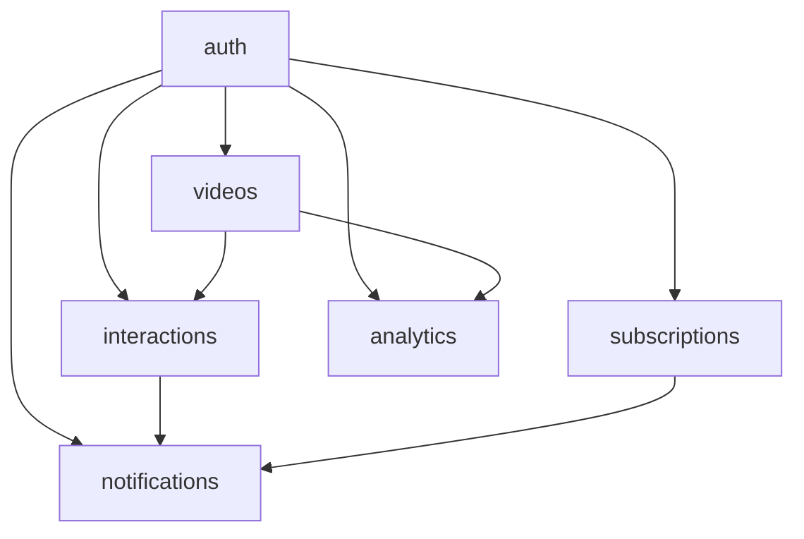

# WatchWave Database Schema Documentation

## Table of Contents
1. [Overview](#overview)
2. [Schema Architecture](#schema-architecture)
3. [Schema Definitions](#schema-definitions)
4. [Core Tables](#core-tables)
5. [Relationships & Constraints](#relationships--constraints)
6. [Indexes & Performance](#indexes--performance)
7. [Data Integrity Rules](#data-integrity-rules)
8. [Usage Guidelines](#usage-guidelines)

---

## Overview

The **WatchWave Database** is designed to support a comprehensive YouTube-like video platform with user management, video content, social interactions, and analytics. The database follows a **multi-schema architecture** for logical separation and scalability.

### Database Statistics
- **6 Schemas** for logical separation
- **15+ Core Tables** covering all platform features
- **Production-Ready** with proper indexing and constraints
- **Scalable Design** supporting millions of users and videos

---

## Schema Architecture



| Schema | Purpose | Core Entities |
|--------|---------|---------------|
| **auth** | User management & authentication | Users, Roles, Profiles |
| **videos** | Video content & metadata | Videos, Tags, Categories |
| **interactions** | User engagement | Comments, Likes, Watch Later |
| **subscriptions** | Creator-subscriber relationships | Subscriptions |
| **notifications** | User notifications | Notifications |
| **analytics** | Data tracking & reporting | History, Reports, Analytics |

---

## Schema Definitions

### Schema Creation
```sql
-- Core schemas for logical separation
CREATE SCHEMA IF NOT EXISTS auth;        -- User authentication & management
CREATE SCHEMA IF NOT EXISTS videos;      -- Video content & metadata
CREATE SCHEMA IF NOT EXISTS interactions;-- User engagement features
CREATE SCHEMA IF NOT EXISTS subscriptions;-- Creator-subscriber system
CREATE SCHEMA IF NOT EXISTS notifications;-- User notification system
CREATE SCHEMA IF NOT EXISTS analytics;   -- Data tracking & analytics
```

---

## Core Tables

### Authentication Schema (auth)

#### 🔐 auth.users
**Purpose:** Core user accounts with authentication data
```sql
CREATE TABLE auth.users (
  id UUID PRIMARY KEY,                    -- Unique user identifier
  username VARCHAR(50) UNIQUE NOT NULL,   -- Display name (unique)
  email VARCHAR(100) UNIQUE NOT NULL,     -- Login email (unique)
  password_hash VARCHAR NOT NULL,         -- BCrypt encrypted password
  profile_pic_url VARCHAR,                -- Profile picture URL
  is_blocked BOOLEAN DEFAULT FALSE,       -- Admin block status
  is_verified BOOLEAN DEFAULT FALSE,      -- Email verification status
  verification_token VARCHAR,             -- Email verification token
  created_at TIMESTAMP DEFAULT CURRENT_TIMESTAMP,
  updated_at TIMESTAMP DEFAULT CURRENT_TIMESTAMP
);
```

#### 👤 auth.user_profiles
**Purpose:** Extended user profile information
```sql
CREATE TABLE auth.user_profiles (
  user_id UUID PRIMARY KEY REFERENCES auth.users(id) ON DELETE CASCADE,
  gender VARCHAR(10),                     -- User gender (optional)
  birthdate DATE,                         -- Date of birth
  location VARCHAR(100),                  -- Geographic location
  bio TEXT,                              -- User biography
  created_at TIMESTAMP DEFAULT CURRENT_TIMESTAMP,
  updated_at TIMESTAMP DEFAULT CURRENT_TIMESTAMP
);
```

#### 🛡️ auth.roles
**Purpose:** System roles for authorization
```sql
CREATE TABLE auth.roles (
  id SERIAL PRIMARY KEY,
  role_name VARCHAR(50) UNIQUE NOT NULL,  -- USER, CREATOR, ADMIN
  description TEXT                        -- Role description
);
```

#### 🔗 auth.user_roles
**Purpose:** Many-to-many relationship between users and roles
```sql
CREATE TABLE auth.user_roles (
  user_id UUID REFERENCES auth.users(id),
  role_id INT REFERENCES auth.roles(id),
  PRIMARY KEY (user_id, role_id)
);
```

#### 📋 auth.role_change_requests
**Purpose:** Role upgrade requests requiring approval
```sql
CREATE TABLE auth.role_change_requests (
  id UUID PRIMARY KEY,
  user_id UUID REFERENCES auth.users(id),
  requested_role VARCHAR(50),             -- Requested role name
  status VARCHAR(20) CHECK (status IN ('PENDING', 'APPROVED', 'REJECTED')) DEFAULT 'PENDING',
  requested_at TIMESTAMP DEFAULT CURRENT_TIMESTAMP,
  reviewed_at TIMESTAMP                   -- When admin reviewed
);
```

### Videos Schema (videos)

#### 🎬 videos.videos
**Purpose:** Core video content with metadata and file information
```sql
CREATE TABLE videos.videos (
  id UUID PRIMARY KEY,
  title VARCHAR NOT NULL,                 -- Video title
  description TEXT,                       -- Video description
  
  -- Video file information
  video_url VARCHAR NOT NULL,             -- Public streaming URL
  video_file_path VARCHAR,                -- Server storage path
  video_file_size BIGINT,                 -- File size in bytes
  video_duration_seconds INT,             -- Video length
  video_resolution VARCHAR(20),           -- e.g., "1920x1080"
  
  -- Thumbnail information (user-uploaded)
  thumbnail_url VARCHAR,                  -- Public thumbnail URL
  thumbnail_file_path VARCHAR,            -- Server storage path
  thumbnail_file_size BIGINT,             -- Thumbnail size in bytes
  thumbnail_content_type VARCHAR(50),     -- MIME type (image/jpeg, etc.)
  
  -- Video metadata
  uploader_id UUID REFERENCES auth.users(id),
  views BIGINT DEFAULT 0,                 -- View count
  visibility VARCHAR(10) CHECK (visibility IN ('PUBLIC', 'PRIVATE', 'UNLISTED')) DEFAULT 'PUBLIC',
  processing_status VARCHAR(20) CHECK (processing_status IN ('UPLOADING', 'PROCESSING', 'READY', 'FAILED')) DEFAULT 'UPLOADING',
  
  -- Settings
  is_comment_enabled BOOLEAN DEFAULT TRUE,
  is_deleted BOOLEAN DEFAULT FALSE,       -- Soft delete flag
  
  -- Timestamps
  created_at TIMESTAMP DEFAULT CURRENT_TIMESTAMP,
  updated_at TIMESTAMP DEFAULT CURRENT_TIMESTAMP
);
```

#### 🏷️ videos.tags
**Purpose:** Video categorization tags
```sql
CREATE TABLE videos.tags (
  id UUID PRIMARY KEY,
  name VARCHAR UNIQUE NOT NULL            -- Tag name (unique)
);
```

#### 🔗 videos.video_tags
**Purpose:** Many-to-many relationship between videos and tags
```sql
CREATE TABLE videos.video_tags (
  video_id UUID REFERENCES videos.videos(id),
  tag_id UUID REFERENCES videos.tags(id),
  PRIMARY KEY (video_id, tag_id)
);
```

### Interactions Schema (interactions)

#### 💬 interactions.comments
**Purpose:** Video comments with threading support
```sql
CREATE TABLE interactions.comments (
  id UUID PRIMARY KEY,
  user_id UUID REFERENCES auth.users(id),
  video_id UUID REFERENCES videos.videos(id),
  parent_id UUID REFERENCES interactions.comments(id), -- For threaded comments
  content TEXT NOT NULL,                  -- Comment text
  is_deleted BOOLEAN DEFAULT FALSE,       -- Soft delete
  deleted_at TIMESTAMP,                   -- Deletion timestamp
  created_at TIMESTAMP DEFAULT CURRENT_TIMESTAMP
);
```

#### 👍 interactions.video_likes
**Purpose:** Video likes and dislikes
```sql
CREATE TABLE interactions.video_likes (
  id UUID PRIMARY KEY,
  user_id UUID REFERENCES auth.users(id),
  video_id UUID REFERENCES videos.videos(id),
  is_like BOOLEAN,                        -- true=like, false=dislike
  created_at TIMESTAMP DEFAULT CURRENT_TIMESTAMP,
  UNIQUE(user_id, video_id)              -- One vote per user per video
);
```

#### ⏰ interactions.watch_later
**Purpose:** User's watch later playlist
```sql
CREATE TABLE interactions.watch_later (
  id UUID PRIMARY KEY,
  user_id UUID REFERENCES auth.users(id),
  video_id UUID REFERENCES videos.videos(id),
  added_at TIMESTAMP DEFAULT CURRENT_TIMESTAMP,
  UNIQUE(user_id, video_id)              -- No duplicates
);
```

### Subscriptions Schema (subscriptions)

#### 🔔 subscriptions.subscriptions
**Purpose:** Creator-subscriber relationships
```sql
CREATE TABLE subscriptions.subscriptions (
  id UUID PRIMARY KEY,
  subscriber_id UUID REFERENCES auth.users(id), -- Who subscribed
  creator_id UUID REFERENCES auth.users(id),    -- To whom they subscribed
  subscribed_at TIMESTAMP DEFAULT CURRENT_TIMESTAMP,
  UNIQUE(subscriber_id, creator_id)      -- No duplicate subscriptions
);
```

### Notifications Schema (notifications)

#### 🔔 notifications.notifications
**Purpose:** User notification system
```sql
CREATE TABLE notifications.notifications (
  id UUID PRIMARY KEY,
  user_id UUID REFERENCES auth.users(id),
  message TEXT,                          -- Notification message
  type VARCHAR(20),                      -- Notification type
  redirect_url VARCHAR,                  -- Action URL
  is_read BOOLEAN DEFAULT FALSE,         -- Read status
  created_at TIMESTAMP DEFAULT CURRENT_TIMESTAMP
);
```

### Analytics Schema (analytics)

#### 📊 analytics.history
**Purpose:** User viewing history and watch analytics
```sql
CREATE TABLE analytics.history (
  id UUID PRIMARY KEY,
  user_id UUID REFERENCES auth.users(id),
  video_id UUID REFERENCES videos.videos(id),
  watched_at TIMESTAMP DEFAULT CURRENT_TIMESTAMP,
  watch_duration_seconds INT,            -- How long they watched
  last_position_seconds INT,             -- Where they stopped
  watch_percent INT                      -- Percentage watched
);
```

#### 🚨 analytics.reports
**Purpose:** Content reporting and moderation
```sql
CREATE TABLE analytics.reports (
  id UUID PRIMARY KEY,
  reporter_id UUID REFERENCES auth.users(id),
  video_id UUID REFERENCES videos.videos(id),
  reason TEXT,                           -- Report reason
  is_resolved BOOLEAN DEFAULT FALSE,     -- Moderation status
  created_at TIMESTAMP DEFAULT CURRENT_TIMESTAMP
);
```

#### 📈 analytics.video_analytics
**Purpose:** Aggregated video statistics
```sql
CREATE TABLE analytics.video_analytics (
  video_id UUID PRIMARY KEY REFERENCES videos.videos(id) ON DELETE CASCADE,
  total_views BIGINT DEFAULT 0,          -- Total view count
  likes BIGINT DEFAULT 0,                -- Total likes
  dislikes BIGINT DEFAULT 0,             -- Total dislikes
  average_watch_time_seconds INT DEFAULT 0 -- Average watch duration
);
```

---

## Relationships & Constraints

### Primary Relationships

#### User-Centric Relationships
- **Users ↔ Videos**: One-to-many (uploader relationship)
- **Users ↔ Roles**: Many-to-many (user can have multiple roles)
- **Users ↔ Subscriptions**: Many-to-many (users subscribe to creators)

#### Video-Centric Relationships
- **Videos ↔ Tags**: Many-to-many (videos can have multiple tags)
- **Videos ↔ Comments**: One-to-many (video can have many comments)
- **Videos ↔ Likes**: One-to-many (video can have many likes/dislikes)

#### Foreign Key Constraints
```sql
-- Critical cascade relationships
ALTER TABLE videos.videos 
ADD CONSTRAINT videos_uploader_id_fkey 
FOREIGN KEY (uploader_id) REFERENCES auth.users(id) ON DELETE SET NULL;

ALTER TABLE videos.video_tags 
ADD CONSTRAINT video_tags_video_id_fkey 
FOREIGN KEY (video_id) REFERENCES videos.videos(id) ON DELETE CASCADE;

ALTER TABLE interactions.comments 
ADD CONSTRAINT comments_video_id_fkey 
FOREIGN KEY (video_id) REFERENCES videos.videos(id) ON DELETE CASCADE;
```

---

## Indexes & Performance

### Primary Indexes
```sql
-- User lookup optimization
CREATE INDEX idx_users_email ON auth.users(email);
CREATE INDEX idx_users_username ON auth.users(username);

-- Video query optimization
CREATE INDEX idx_videos_uploader_id ON videos.videos(uploader_id);
CREATE INDEX idx_videos_visibility ON videos.videos(visibility);
CREATE INDEX idx_videos_created_at ON videos.videos(created_at DESC);
CREATE INDEX idx_videos_views ON videos.videos(views DESC);
CREATE INDEX idx_videos_processing_status ON videos.videos(processing_status);

-- Interaction optimization
CREATE INDEX idx_comments_video_id ON interactions.comments(video_id);
CREATE INDEX idx_video_likes_video_id ON interactions.video_likes(video_id);
CREATE INDEX idx_video_likes_user_id ON interactions.video_likes(user_id);

-- Analytics optimization
CREATE INDEX idx_history_user_id ON analytics.history(user_id);
CREATE INDEX idx_history_video_id ON analytics.history(video_id);
```

### Composite Indexes
```sql
-- Common query patterns
CREATE INDEX idx_videos_uploader_visibility ON videos.videos(uploader_id, visibility);
CREATE INDEX idx_videos_public_recent ON videos.videos(visibility, created_at DESC)
WHERE visibility = 'PUBLIC' AND is_deleted = FALSE;
```

---

## Data Integrity Rules

### Business Logic Constraints
```sql
-- File size validation
ALTER TABLE videos.videos 
ADD CONSTRAINT check_video_file_size CHECK (video_file_size > 0),
ADD CONSTRAINT check_thumbnail_file_size CHECK (thumbnail_file_size > 0),
ADD CONSTRAINT check_video_duration CHECK (video_duration_seconds >= 0);

-- Like/dislike validation
ALTER TABLE interactions.video_likes 
ADD CONSTRAINT check_is_like_not_null CHECK (is_like IS NOT NULL);

-- Analytics validation
ALTER TABLE analytics.history 
ADD CONSTRAINT check_watch_duration CHECK (watch_duration_seconds >= 0),
ADD CONSTRAINT check_watch_percent CHECK (watch_percent BETWEEN 0 AND 100);
```

### Automatic Timestamp Updates
```sql
-- Auto-update timestamp function
CREATE OR REPLACE FUNCTION auth.update_updated_at_column()
RETURNS TRIGGER AS $$
BEGIN
  NEW.updated_at = NOW();
  RETURN NEW;
END;
$$ LANGUAGE plpgsql;

-- Apply to relevant tables
CREATE TRIGGER trigger_update_users_updated_at
BEFORE UPDATE ON auth.users FOR EACH ROW
EXECUTE FUNCTION auth.update_updated_at_column();

CREATE TRIGGER trigger_update_videos_updated_at
BEFORE UPDATE ON videos.videos FOR EACH ROW
EXECUTE FUNCTION auth.update_updated_at_column();
```

---

## Usage Guidelines

### Data Access Patterns

#### Common Queries
```sql
-- Get user's videos
SELECT * FROM videos.videos 
WHERE uploader_id = ? AND visibility = 'PUBLIC' AND is_deleted = FALSE
ORDER BY created_at DESC;

-- Get video with analytics
SELECT v.*, va.total_views, va.likes, va.dislikes 
FROM videos.videos v
LEFT JOIN analytics.video_analytics va ON v.id = va.video_id
WHERE v.id = ?;

-- Get user's subscription feed
SELECT v.* FROM videos.videos v
JOIN subscriptions.subscriptions s ON v.uploader_id = s.creator_id
WHERE s.subscriber_id = ? AND v.visibility = 'PUBLIC'
ORDER BY v.created_at DESC;
```

#### Performance Tips
- **Always use indexes** for WHERE clauses
- **Limit result sets** with LIMIT and OFFSET for pagination
- **Use specific columns** instead of SELECT *
- **Join only necessary tables** for each query

### Data Maintenance

#### Regular Maintenance Tasks
- **Update video analytics** from interaction tables
- **Clean up expired verification tokens**
- **Archive old notification records**
- **Optimize query performance** with ANALYZE

#### Backup Strategy
- **Full database backup** daily
- **Transaction log backup** every 15 minutes
- **Schema-specific backups** for critical schemas (auth, videos)

---

## Schema Evolution

### Version Control
- **Track schema changes** in migration files
- **Document breaking changes** and migration paths
- **Test migrations** on staging environment first

### Future Enhancements
- **Video playlists** (videos schema)
- **Live streaming** support (videos schema)
- **Advanced analytics** (analytics schema)
- **Content moderation** tools (interactions schema)

---

**This database schema provides a solid foundation for a scalable YouTube-like platform, supporting millions of users, videos, and interactions while maintaining data integrity and performance.**

Citations:
[1] https://ppl-ai-file-upload.s3.amazonaws.com/web/direct-files/attachments/71543222/5aa53b81-5cf8-48dd-abfb-94f2023b5c86/paste.txt
[2] https://www.cockroachlabs.com/blog/database-schema-beginners-guide/
[3] https://mercury.com/blog/documenting-your-database-schema
[4] https://www.integrate.io/blog/complete-guide-to-database-schema-design-guide/
[5] https://www.confluent.io/blog/streaming-database-design-principles-and-guarantees/
[6] https://stackoverflow.com/questions/369266/how-to-document-a-database
[7] https://hygraph.com/blog/cms-best-practice-streaming-platforms
[8] https://cloud.google.com/spanner/docs/schema-design
[9] https://www.reddit.com/r/dataengineering/comments/18tgg69/best_practices_for_documenting_database_design/
[10] https://netflixtechblog.com/implementing-the-netflix-media-database-53b5a840b42a
[11] https://www.scylladb.com/2024/01/09/build-a-low-latency-video-streaming-app/

---
Answer from Perplexity: pplx.ai/share